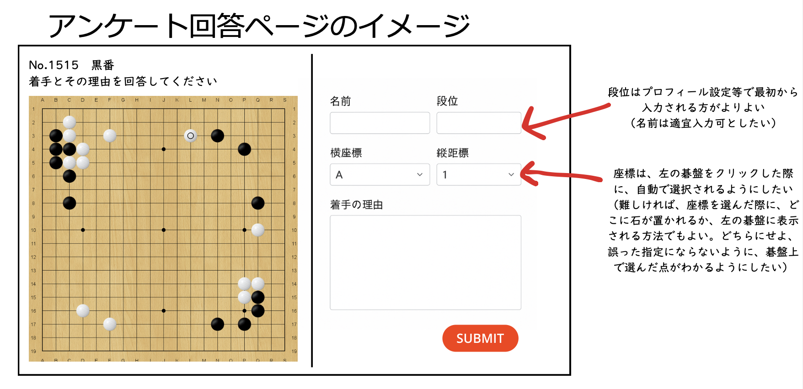
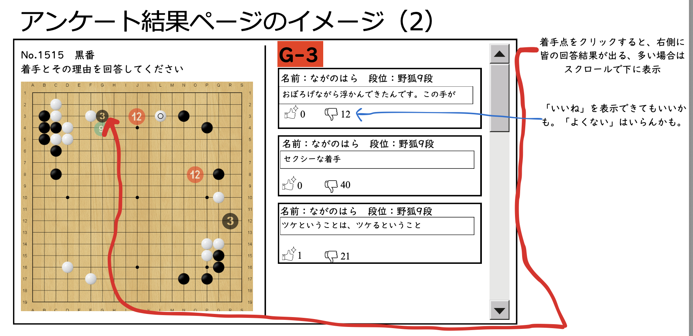
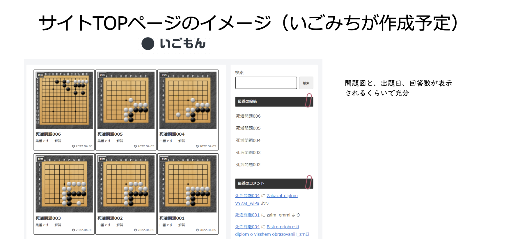

# 囲碁アンケートサイト「いごもん」仕様書

## 1. サイトコンセプト

序盤や中盤など、手の選択肢が広い局面において、「なぜそこに打ちたいのか」という『着手の理由』を集めることを目的としたアンケートサイトである。

多くの人の意見を集めるため、原則として回答者のみが他のユーザーの回答結果を閲覧できる形式とする。

級位者から高段者まで、幅広い棋力層のユーザーが気軽に参加できるよう、シンプルで使いやすいシステムを目指す。

## 2. 機能要件

### 2.1. アンケート回答ページ (/questionnaire/{problem_id})

各問題ごとに、一意のURLを持つアンケート回答ページを生成する [user request]。

ページには、SGFファイルから読み込んだ問題の盤面が表示される [user request]。表示する手数は、description.txtのmovesパラメータで指定された手数まで（指定がない場合は最終手まで）とする。

ユーザーは盤面をクリックすることで着手点を選択でき、選択した座標はフォームに自動入力される。座標はUI上では標準囲碁記法（A1〜T19）で表示され、データベースにはSGF形式（aa, ab, ac...）で保存される。

ユーザーは着手を選択し、「着手の理由」「名前」「段位」を入力して回答を送信する。

「名前」と「段位」は、ユーザーのブラウザのローカルストレージに保存され、次回以降の回答時には自動で入力欄にセットされる（代案の採用） [user request]。

### 2.2. アンケート結果表示ページ

ユーザーがアンケートに回答を送信すると、その問題の結果表示ページへ遷移する。

結果ページでは、盤面上に各着手の得票数が数字で表示される。

得票数に応じて数字の背景色や文字色を変えることで、人気度を視覚的に分かりやすく表示する（例：得票数10以上は赤色、5-9票は橙色、1-4票は青色など）。

盤面の数字をクリックすると、その座標に投票したユーザーの回答（名前、段位、理由）の一覧が右側などに表示される。座標表示は標準囲碁記法（A1〜T19）を使用する。

### 2.3. 投稿削除機能

ユーザーは自分が投稿した回答を削除することができる。

削除機能は、ユーザーのブラウザのCookieまたはローカルストレージに保存された識別情報を用いて、自分の投稿のみを削除対象とする。

削除された回答は、データベースから完全に削除されるか、削除フラグを設定して非表示にする。

削除後は、該当する着手の得票数が減算され、結果表示ページに即座に反映される。

削除機能へのアクセスは、結果表示ページの回答一覧において、自分の投稿にのみ「削除」ボタンが表示される形式とする。

### 2.4. サイトトップページ (/)

サイトのトップページ (https://igomon.net/) では、作成された問題の一覧が表示される [user request]。

問題はdescription.txtに記載されたcreatedの日付を元に、新しいものが上に表示される（作成日時の新しい順） [user request]。

一覧には、問題の盤面サムネイル、問題番号、手番などの情報が表示されることが望ましい。

## 3. 非機能要件

### 3.1. ユーザー認証と識別

Google/XなどのSNSログイン機能は使用しない [user request]。

ユーザーの識別と「回答済みか否か」の判定は、ブラウザのCookieまたはローカルストレージを用いて行う [user request]。

これにより、同一ブラウザであれば、一度回答した問題の結果は閲覧できるが、Cookieを削除したり、別ブラウザでアクセスした場合は未回答の状態として扱われる。

### 3.2. データ永続化

ユーザーから送信されたアンケート回答（着手座標、理由、名前、段位）は、サーバーサイドの **SQLite データベース**に保存する。

**ORマッパー:** Prisma を使用（型安全性、スキーマ管理、マイグレーション機能のため）

SQLiteを選択する理由：
- XServerの共有サーバー環境に適している
- ファイルベースで管理が簡単
- バックアップは単純なファイルコピー
- 予想される負荷（数十の同時アクセス、数千の回答データ）に十分対応可能

ユーザー利便性のための「名前」「段位」の情報は、ユーザーのブラウザのローカルストレージに保存する [user request]。

### 3.3. URL設計とOGP

**サイトURL:** https://igomon.net/ [user request]

**問題ページURL:** /questionnaire/{problem_id} の形式（例: /questionnaire/1） [user request]

問題ページのURLは、X (旧Twitter) などで共有された際に直接アクセスできる必要がある [user request]。

Xで共有された際に分かりやすいカードが表示されるよう、OGP (Open Graph Protocol) を設定する。

- **OGP画像:** 問題の盤面画像（1200x630px、Twitter推奨サイズ）
- **OGPタイトル:** 問題番号や手番などのタイトル
- **OGP説明文:** 問題の説明文
- **OGP画像生成:** problems/ディレクトリに新規配置された時に自動生成

## 4. コンテンツ管理

### 4.1. 問題の作成方法

問題は、サーバーの `public/problems` ディレクトリに、問題ごとのサブディレクトリを配置することで生成される [user request]。

各問題のディレクトリには、盤面データである`kifu.sgf`ファイルと、問題情報を記述した`description.txt`ファイルを配置する [user request]。

**ディレクトリ構造例:**

```
igomon-app/
├── public/
│   └── problems/
│       ├── 1/
│       │   ├── kifu.sgf
│       │   └── description.txt
│       ├── 2/
│       │   ├── kifu.sgf
│       │   └── description.txt
│       └── 1515/
│           ├── kifu.sgf
│           └── description.txt
```

### 4.2. description.txt フォーマット

`description.txt`は、以下の「キー: 値」形式で記述する（提案の採用） [user request]。

```plaintext
id: 1515
turn: black
created: 2025-06-27
moves: 30
description: 着手とその理由を回答してください。
```

- **id:** (必須) ページに表示される問題番号。
- **turn:** (必須) 手番。black または white で指定。
- **created:** (必須) 問題の作成日。トップページでの並び替えに使用。
- **moves:** (任意) 表示する手数。指定がない場合は最終手まで表示。
- **description:** (必須) 盤の下に表示される説明文。

## 5. UIイメージ

### アンケート回答ページのイメージ


### アンケート結果表示ページのイメージ


### サイトトップページのイメージ


## 6. 実装対象外（除外機能）

以下の機能は、今回の実装範囲に含まない。

- Google/Xアカウント等を利用したログイン機能
- 回答に対する「いいね」「よくない」ボタン
- サイトトップページの検索機能、最近の投稿・コメント欄
- アンケート結果のCSV形式でのデータ収集機能 [user request]
- ユーザーによる回答の編集機能（削除機能は実装対象）

## 7. 技術仕様詳細

### 7.1. ユーザー識別システム

**ユーザーID生成:**
- 投稿時にUUID（v4）を生成してユーザーを識別
- UUIDはローカルストレージに保存（推奨）
- サーバー側では認証なしで、UUIDの一致確認により投稿者を特定
- UUID衝突対策として、crypto.randomUUID()を使用（暗号学的に安全）

**実装方針:**
```javascript
// 初回アクセス時またはUUIDが存在しない場合
const userUuid = localStorage.getItem('igomon_user_uuid') || 
                crypto.randomUUID();
localStorage.setItem('igomon_user_uuid', userUuid);
```

### 7.2. 削除機能の実装

**削除方式:** 論理削除（物理削除は行わない）

**削除フロー:**
1. ユーザーが自分の投稿の「削除」ボタンをクリック
2. フロントエンドからローカルストレージのUUIDを含むDELETEリクエスト送信
3. サーバー側でUUIDの一致を確認
4. `is_deleted`フラグをtrueに更新
5. 得票数を再計算して結果表示を更新

**削除権限:**
- 結果表示ページで自分の投稿のみに「削除」ボタンを表示
- UUIDが一致する投稿のみ削除可能

### 7.3. SGFファイル処理

**使用ライブラリ:** WGo.js
- SGF解析、盤面描画、座標変換を統合サポート
- Canvas/SVG両対応でレスポンシブ
- 19路盤のみ対応

**表示仕様:**
- SGFファイルから指定手数まで（またはdescription.txtのmovesパラメータまで）の局面を表示
- movesパラメータが指定されていない場合は最終手まで表示
- コメントやバリエーションは無視する
- ユーザーは盤面クリックで着手点を選択
- クリック座標は自動的にSGF形式に変換してフォームに入力

**座標システム:**
- データベース保存: SGF座標（aa, ab, ac...）
- 内部処理: 数値座標 (0,0)〜(18,18)
- UI表示: 標準囲碁記法（A1〜T19）
- WGo.jsの座標変換機能を活用

**座標の対応関係:**
- A19 = WGo.js (0, 0) = SGF "aa"
- T19 = WGo.js (18, 0) = SGF "sa"
- A1 = WGo.js (0, 18) = SGF "as"
- T1 = WGo.js (18, 18) = SGF "ss"

### 7.4. データベース設計（Prisma + SQLite）

**Prismaスキーマ:**
```prisma
// prisma/schema.prisma
generator client {
  provider = "prisma-client-js"
}

datasource db {
  provider = "sqlite"
  url      = "file:./igomon.db"
}

model Problem {
  id          Int      @id
  sgfFilePath String   @map("sgf_file_path")
  description String
  turn        String   // "black" or "white"
  createdDate String   @map("created_date")
  createdAt   DateTime @default(now()) @map("created_at")
  updatedAt   DateTime @updatedAt @map("updated_at")
  answers     Answer[]

  @@map("problems")
}

model Answer {
  id          Int      @id @default(autoincrement())
  problemId   Int      @map("problem_id")
  userUuid    String   @map("user_uuid")
  coordinate  String   // SGF座標 (aa, ab, etc.)
  reason      String
  playerName  String   @map("player_name")
  playerRank  String   @map("player_rank")
  isDeleted   Boolean  @default(false) @map("is_deleted")
  createdAt   DateTime @default(now()) @map("created_at")
  updatedAt   DateTime @updatedAt @map("updated_at")
  
  problem     Problem  @relation(fields: [problemId], references: [id])

  @@index([problemId])
  @@index([userUuid])
  @@index([coordinate])
  @@index([isDeleted])
  @@map("answers")
}
```

### 7.5. 結果表示機能

**盤面表示:**
- WGo.jsを使用して盤面上に得票数を数字で表示
- 得票数に応じた色分けやサイズ調整が可能
- 数字クリック時に該当座標の回答一覧を表示

**実装例:**
```javascript
// 結果データを盤面に表示
results.forEach(result => {
    const coords = sgfToWgoCoords(result.coordinate);
    board.addObject({
        x: coords.x, y: coords.y,
        type: "mark",
        mark: {
            type: "label",
            text: result.votes.toString(),
            color: getColorByVotes(result.votes)
        }
    });
});

// 座標変換関数
function sgfToWgoCoords(sgf) {
    const x = sgf.charCodeAt(0) - 'a'.charCodeAt(0);
    const y = sgf.charCodeAt(1) - 'a'.charCodeAt(0);
    return { x, y };
}

function wgoToSgfCoords(x, y) {
    return String.fromCharCode('a'.charCodeAt(0) + x) + 
           String.fromCharCode('a'.charCodeAt(0) + y);
}

function wgoToStandardNotation(x, y) {
    const letters = 'ABCDEFGHJKLMNOPQRST'; // Iを除く
    return letters[x] + (19 - y);
}
```

### 7.6. OGP画像生成

**推奨方法:** Node.js + Canvas

**実装戦略:**
1. problems/ディレクトリに新規ファイルが配置された時に自動実行
2. SGFファイルを解析して盤面状態を取得（movesパラメータまで）
3. Canvasで19x19の碁盤を描画
4. 石を配置して1200x630pxのPNG画像として生成
5. public/ogp/problem_{id}.png として保存
6. 画像にタイトルや問題番号は含めない（盤面のみ）

**実装例:**
```javascript
const { createCanvas } = require('canvas');

function generateOgpImage(sgfContent, problemId) {
    const canvas = createCanvas(600, 600);
    const ctx = canvas.getContext('2d');
    
    // 碁盤を描画
    drawBoard(ctx);
    
    // SGFから石の配置を読み込んで描画
    const stones = parseSgf(sgfContent);
    drawStones(ctx, stones);
    
    // PNG画像として保存
    const buffer = canvas.toBuffer('image/png');
    fs.writeFileSync(`public/ogp/problem_${problemId}.png`, buffer);
}
```

### 7.7. API設計

**主要エンドポイント:**

```
GET  /questionnaire/{problem_id}     # アンケート回答ページ
POST /api/answers                    # 回答投稿
GET  /api/results/{problem_id}       # 結果取得
DELETE /api/answers/{answer_id}      # 回答削除（論理削除）
GET  /api/problems                   # 問題一覧
GET  /api/sgf/{problem_id}          # SGFファイル取得
```

**投稿データ形式:**
```json
{
    "problem_id": 1,
    "user_uuid": "550e8400-e29b-41d4-a716-446655440000",
    "coordinate": "dd",
    "reason": "この手が最も効率的だと思います",
    "player_name": "田中太郎",
    "player_rank": "3段"
}
```

## 8. XServer向け統合技術構成

### 8.1. 推奨技術スタック

**フルスタック構成:**
- **フロントエンド:** React + TypeScript
- **バックエンド:** Express.js + TypeScript
- **データベース:** SQLite + Prisma
- **碁盤表示:** WGo.js
- **OGP画像生成:** Node.js Canvas
- **デプロイ:** XServer Node.js環境

### 8.2. プロジェクト構成

```
igomon-app/
├── prisma/
│   ├── schema.prisma              // Prismaスキーマ
│   └── migrations/                // マイグレーションファイル
├── server/
│   ├── index.ts                   // Express.jsサーバー（PM2/forever不要）
│   ├── routes/
│   │   ├── api.ts                 // API ルート
│   │   ├── answers.ts             // 回答関連API
│   │   └── problems.ts            // 問題関連API
│   └── utils/
│       ├── sgf-parser.ts          // SGF処理（手数指定対応）
│       └── ogp-generator.ts       // OGP画像生成
├── client/
│   ├── src/
│   │   ├── components/
│   │   │   ├── GoBoard.tsx        // WGo.js碁盤コンポーネント
│   │   │   ├── AnswerForm.tsx     // 回答フォーム
│   │   │   └── ResultsDisplay.tsx // 結果表示
│   │   ├── pages/
│   │   │   ├── Home.tsx           // トップページ
│   │   │   ├── Questionnaire.tsx  // アンケートページ
│   │   │   └── Results.tsx        // 結果ページ
│   │   ├── utils/
│   │   │   ├── api.ts             // API呼び出し
│   │   │   └── uuid.ts            // UUID管理
│   │   └── App.tsx
├── public/
│   ├── problems/                  // SGFファイル
│   ├── ogp/                      // 生成OGP画像
│   └── dist/                     // ビルド済みフロントエンド
├── lib/
│   └── database.ts               // Prisma Client操作
├── package.json
├── tsconfig.json
└── igomon.db                     // SQLiteデータベースファイル
```

### 8.3. 依存関係

```json
{
  "name": "igomon-app",
  "version": "1.0.0",
  "engines": {
    "node": "18.x"
  },
  "dependencies": {
    "chokidar": "^3.5.0",
    "cors": "^2.8.5",
    "express": "^4.18.0",
    "prisma": "^5.0.0",
    "@prisma/client": "^5.0.0",
    "socket.io": "^4.7.0",
    "socket.io-client": "^4.7.0",
    "wgo": "^2.3.1",
    "canvas": "^2.11.0",
    "uuid": "^9.0.0",
    "react": "^18.0.0",
    "react-dom": "^18.0.0",
    "react-router-dom": "^6.0.0",
    "typescript": "^5.0.0",
    "@types/chokidar": "^3.5.0",
    "@types/node": "^20.0.0",
    "@types/express": "^4.17.0",
    "@types/socket.io": "^3.0.0",
    "@types/uuid": "^9.0.0"
  },
  "devDependencies": {
    "@vitejs/plugin-react": "^4.0.0",
    "nodemon": "^3.0.0",
    "ts-node": "^10.0.0",
    "vite": "^4.0.0"
  },
  "scripts": {
    "dev:client": "vite",
    "dev:server": "nodemon --exec ts-node server/index.ts",
    "build:client": "vite build --outDir ../public/dist",
    "build:server": "tsc server/index.ts --outDir dist",
    "start": "node dist/server/index.js",
    "db:migrate": "prisma migrate dev",
    "db:generate": "prisma generate",
    "db:studio": "prisma studio"
  }
}
```

### 8.4. データベース操作（Prisma実装）

```typescript
// lib/database.ts
import { PrismaClient } from '@prisma/client';

const prisma = new PrismaClient();

// 回答の保存
export async function saveAnswer(answerData: {
  problemId: number;
  userUuid: string;
  coordinate: string;
  reason: string;
  playerName: string;
  playerRank: string;
}) {
  return await prisma.answer.create({
    data: answerData
  });
}

// 結果の取得
export async function getResults(problemId: number) {
  const answers = await prisma.answer.findMany({
    where: { 
      problemId: problemId, 
      isDeleted: false 
    },
    orderBy: { createdAt: 'asc' }
  });
  
  // 座標ごとの集計
  const results: Record<string, { votes: number; answers: any[] }> = {};
  answers.forEach(answer => {
    if (!results[answer.coordinate]) {
      results[answer.coordinate] = { votes: 0, answers: [] };
    }
    results[answer.coordinate].votes++;
    results[answer.coordinate].answers.push(answer);
  });
  
  return results;
}

// 回答の削除（論理削除）
export async function deleteAnswer(answerId: number, userUuid: string) {
  const result = await prisma.answer.updateMany({
    where: { 
      id: answerId, 
      userUuid: userUuid,
      isDeleted: false 
    },
    data: { 
      isDeleted: true,
      updatedAt: new Date()
    }
  });
  
  return result.count > 0;
}

// 問題一覧の取得
export async function getProblems() {
  return await prisma.problem.findMany({
    orderBy: { createdDate: 'desc' },
    include: {
      _count: {
        select: {
          answers: {
            where: { isDeleted: false }
          }
        }
      }
    }
  });
}

// 問題の詳細取得
export async function getProblem(problemId: number) {
  return await prisma.problem.findUnique({
    where: { id: problemId }
  });
}

// 問題の存在確認（ID重複チェック用）
export async function problemExists(problemId: number) {
  const problem = await prisma.problem.findUnique({
    where: { id: problemId },
    select: { id: true }
  });
  return !!problem;
}

// ユーザーが既に回答済みかチェック
export async function hasUserAnswered(problemId: number, userUuid: string) {
  const answer = await prisma.answer.findFirst({
    where: {
      problemId: problemId,
      userUuid: userUuid,
      isDeleted: false
    }
  });
  return !!answer;
}

export default prisma;
```

### 8.5. API実装例（Express.js + Prisma）

```typescript
// server/routes/api.ts
import express from 'express';
import { 
  saveAnswer, 
  getResults, 
  deleteAnswer, 
  getProblems,
  getProblem,
  hasUserAnswered 
} from '../lib/database';

const router = express.Router();

// 回答投稿
router.post('/answers', async (req, res) => {
  try {
    const { problemId, userUuid, coordinate, reason, playerName, playerRank } = req.body;
    
    // 既に回答済みかチェック
    const alreadyAnswered = await hasUserAnswered(problemId, userUuid);
    if (alreadyAnswered) {
      return res.status(400).json({ error: 'Already answered this problem' });
    }
    
    const result = await saveAnswer({
      problemId,
      userUuid,
      coordinate,
      reason,
      playerName,
      playerRank
    });
    
    res.json(result);
  } catch (error) {
    console.error('Error saving answer:', error);
    res.status(500).json({ error: 'Failed to save answer' });
  }
});

// 結果取得
router.get('/results/:problemId', async (req, res) => {
  try {
    const problemId = parseInt(req.params.problemId);
    const results = await getResults(problemId);
    res.json(results);
  } catch (error) {
    console.error('Error getting results:', error);
    res.status(500).json({ error: 'Failed to get results' });
  }
});

// 回答削除
router.delete('/answers/:answerId', async (req, res) => {
  try {
    const answerId = parseInt(req.params.answerId);
    const { userUuid } = req.body;
    
    const success = await deleteAnswer(answerId, userUuid);
    
    if (success) {
      res.json({ success: true });
    } else {
      res.status(404).json({ error: 'Answer not found or not authorized' });
    }
  } catch (error) {
    console.error('Error deleting answer:', error);
    res.status(500).json({ error: 'Failed to delete answer' });
  }
});

// 問題一覧取得
router.get('/problems', async (req, res) => {
  try {
    const problems = await getProblems();
    res.json(problems);
  } catch (error) {
    console.error('Error getting problems:', error);
    res.status(500).json({ error: 'Failed to get problems' });
  }
});

// 問題詳細取得
router.get('/problems/:problemId', async (req, res) => {
  try {
    const problemId = parseInt(req.params.problemId);
    const problem = await getProblem(problemId);
    
    if (!problem) {
      return res.status(404).json({ error: 'Problem not found' });
    }
    
    res.json(problem);
  } catch (error) {
    console.error('Error getting problem:', error);
    res.status(500).json({ error: 'Failed to get problem' });
  }
});

// SGFファイル取得
router.get('/sgf/:problemId', (req, res) => {
  try {
    const problemId = req.params.problemId;
    const problemData = loadProblemFromDirectory(problemId);
    
    if (!problemData) {
      return res.status(404).json({ error: 'Problem not found' });
    }
    
    res.setHeader('Content-Type', 'application/x-go-sgf');
    res.send(problemData.sgfContent);
  } catch (error) {
    console.error('Error getting SGF:', error);
    res.status(500).json({ error: 'Failed to get SGF' });
  }
});

// 問題一覧取得（ファイルベース + データベース統合）
router.get('/problems', async (req, res) => {
  try {
    // ファイルシステムから問題一覧を取得
    const fileProblems = getAllProblems();
    
    // データベースの回答数も含めて返す
    const problemsWithCounts = await Promise.all(
      fileProblems.map(async (problem) => {
        const answerCount = await prisma.answer.count({
          where: {
            problemId: problem.id,
            isDeleted: false
          }
        });
        
        return {
          ...problem,
          answerCount
        };
      })
    );
    
    res.json(problemsWithCounts);
  } catch (error) {
    console.error('Error getting problems:', error);
    res.status(500).json({ error: 'Failed to get problems' });
  }
});
```

### 8.6. Expressサーバー設定

```typescript
// server/index.ts
import express from 'express';
import { createServer } from 'http';
import { Server as SocketIOServer } from 'socket.io';
import cors from 'cors';
import path from 'path';
import apiRoutes from './routes/api';
import { ProblemWatcher } from './utils/file-watcher';
import { getAllProblems } from './utils/problem-loader';

const app = express();
const server = createServer(app);
const io = new SocketIOServer(server, {
  cors: {
    origin: "*",
    methods: ["GET", "POST"]
  }
});

const port = process.env.PORT || 3000;

// ミドルウェア
app.use(cors());
app.use(express.json());
app.use(express.urlencoded({ extended: true }));

// 静的ファイル配信
app.use(express.static(path.join(__dirname, '../public/dist')));
app.use('/problems', express.static(path.join(__dirname, '../public/problems')));
app.use('/ogp', express.static(path.join(__dirname, '../public/ogp')));

// API ルート
app.use('/api', apiRoutes);

// WebSocket接続処理
io.on('connection', (socket) => {
  console.log('Client connected:', socket.id);
  
  // 接続時に現在の問題一覧を送信
  socket.emit('initialProblems', getAllProblems());
  
  socket.on('disconnect', () => {
    console.log('Client disconnected:', socket.id);
  });
});

// ファイル監視を開始
const problemWatcher = new ProblemWatcher(io);

// SPA用のフォールバック
app.get('*', (req, res) => {
  res.sendFile(path.join(__dirname, '../public/dist/index.html'));
});

// サーバー終了時のクリーンアップ
process.on('SIGTERM', () => {
  problemWatcher.destroy();
  server.close();
});

server.listen(port, () => {
  console.log(`Server running on port ${port}`);
});
```

### 8.7. フロントエンド実装例

```typescript
// client/src/utils/uuid.ts
export function getUserUuid(): string {
  let uuid = localStorage.getItem('igomon_user_uuid');
  if (!uuid) {
    uuid = crypto.randomUUID();
    localStorage.setItem('igomon_user_uuid', uuid);
  }
  return uuid;
}

// client/src/utils/api.ts
export async function submitAnswer(answerData: {
  problemId: number;
  coordinate: string;
  reason: string;
  playerName: string;
  playerRank: string;
}) {
  const userUuid = getUserUuid();
  
  const response = await fetch('/api/answers', {
    method: 'POST',
    headers: {
      'Content-Type': 'application/json',
    },
    body: JSON.stringify({
      ...answerData,
      userUuid
    }),
  });
  
  if (!response.ok) {
    throw new Error('Failed to submit answer');
  }
  
  return response.json();
}

export async function getResults(problemId: number) {
  const response = await fetch(`/api/results/${problemId}`);
  if (!response.ok) {
    throw new Error('Failed to get results');
  }
  return response.json();
}

export async function deleteAnswer(answerId: number) {
  const userUuid = getUserUuid();
  
  const response = await fetch(`/api/answers/${answerId}`, {
    method: 'DELETE',
    headers: {
      'Content-Type': 'application/json',
    },
    body: JSON.stringify({ userUuid }),
  });
  
  if (!response.ok) {
    throw new Error('Failed to delete answer');
  }
  
  return response.json();
}
```

### 8.8. Prismaセットアップコマンド

```bash
# プロジェクト初期化
npm init -y

# 依存関係インストール
npm install

# Prismaの初期化（SQLite用）
npx prisma init --datasource-provider sqlite

# マイグレーション実行
npx prisma migrate dev --name init

# Prisma Clientの生成
npx prisma generate

# 開発用データベース確認
npx prisma studio

# 開発サーバー起動
npm run dev:client  # フロントエンド
npm run dev:server  # バックエンド
```

### 8.9. XServerデプロイ手順

1. **ビルド実行:**
```bash
npm run build:client  # React アプリのビルド
npm run build:server  # TypeScript サーバーのビルド
```

2. **ファイルアップロード:**
- `public/dist/` → XServer 公開ディレクトリ
- `dist/server/` → Node.js アプリディレクトリ
- `prisma/` → Prisma 設定ファイル
- `igomon.db` → SQLite データベースファイル

3. **XServer での起動設定:**
```javascript
// XServer用の起動ファイル
const app = require('./dist/server/index.js');
```

この構成により、XServerの制約下でもPrismaを使用した型安全で保守しやすい「いごもん」アプリケーションを構築できます。

### 8.10. 問題ファイル読み込み処理

```typescript
// server/utils/problem-loader.ts
import fs from 'fs';
import path from 'path';

interface ProblemData {
  id: number;
  turn: string;
  createdDate: string;
  description: string;
  sgfContent: string;
}

export function loadProblemFromDirectory(problemId: string): ProblemData | null {
  const problemDir = path.join(__dirname, '../../public/problems', problemId);
  
  try {
    // description.txt の読み込み
    const descriptionPath = path.join(problemDir, 'description.txt');
    const descriptionContent = fs.readFileSync(descriptionPath, 'utf-8');
    
    // SGFファイルの読み込み
    const sgfPath = path.join(problemDir, 'kifu.sgf');
    const sgfContent = fs.readFileSync(sgfPath, 'utf-8');
    
    // description.txt のパース
    const problemData = parseDescriptionFile(descriptionContent);
    
    return {
      ...problemData,
      sgfContent
    };
  } catch (error) {
    console.error(`Failed to load problem ${problemId}:`, error);
    return null;
  }
}

function parseDescriptionFile(content: string): Omit<ProblemData, 'sgfContent'> {
  const lines = content.trim().split('\n');
  const data: any = {};
  
  lines.forEach(line => {
    const [key, ...valueParts] = line.split(':');
    if (key && valueParts.length > 0) {
      data[key.trim()] = valueParts.join(':').trim();
    }
  });
  
  // 必須項目のチェック
  if (!data.id || !data.turn || !data.created || !data.description) {
    throw new Error('必須項目が不足しています: id, turn, created, description');
  }
  
  return {
    id: parseInt(data.id),
    turn: data.turn,
    createdDate: data.created,
    description: data.description,
    moves: data.moves ? parseInt(data.moves) : undefined
  };
}

// 全問題の一覧を取得
export function getAllProblems(): ProblemData[] {
  const problemsDir = path.join(__dirname, '../../public/problems');
  
  try {
    const problemDirs = fs.readdirSync(problemsDir, { withFileTypes: true })
      .filter(dirent => dirent.isDirectory())
      .map(dirent => dirent.name);
    
    const problems: ProblemData[] = [];
    
    problemDirs.forEach(dirName => {
      const problemData = loadProblemFromDirectory(dirName);
      if (problemData) {
        problems.push(problemData);
      }
    });
    
    // 作成日時順でソート（新しい順）
    return problems.sort((a, b) => 
      new Date(b.createdDate).getTime() - new Date(a.createdDate).getTime()
    );
  } catch (error) {
    console.error('Failed to load problems:', error);
    return [];
  }
}
```

### 8.11. リアルタイム問題一覧更新機能

**実装方式:** ファイルシステム監視 + WebSocket

新しい問題が `public/problems/` ディレクトリに追加された際に、トップページの問題一覧にリアルタイムで反映される機能を実装する。

**技術構成:**
- Node.js `chokidar` ライブラリでファイルシステム監視
- Socket.io でWebSocket通信
- クライアントサイドでリアルタイム更新

**サーバーサイド実装:**

```typescript
// server/utils/file-watcher.ts
import chokidar from 'chokidar';
import { Server as SocketIOServer } from 'socket.io';
import path from 'path';
import { loadProblemFromDirectory, getAllProblems } from './problem-loader';

export class ProblemWatcher {
  private io: SocketIOServer;
  private watcher: chokidar.FSWatcher;
  private problemsDir: string;

  constructor(io: SocketIOServer) {
    this.io = io;
    this.problemsDir = path.join(__dirname, '../../public/problems');
    this.initializeWatcher();
  }

  private initializeWatcher() {
    // problems ディレクトリの変更を監視
    this.watcher = chokidar.watch(this.problemsDir, {
      ignored: /node_modules/,
      persistent: true,
      depth: 2 // 問題ディレクトリ内のファイルまで監視
    });

    // 新しいディレクトリが追加された場合
    this.watcher.on('addDir', (dirPath) => {
      if (this.isProblemDirectory(dirPath)) {
        this.handleNewProblem(dirPath);
      }
    });

    // ファイルが追加された場合（description.txt や kifu.sgf）
    this.watcher.on('add', (filePath) => {
      if (this.isRelevantFile(filePath)) {
        const problemDir = path.dirname(filePath);
        this.handleProblemUpdate(problemDir);
      }
    });

    // ファイルが変更された場合
    this.watcher.on('change', (filePath) => {
      if (this.isRelevantFile(filePath)) {
        const problemDir = path.dirname(filePath);
        this.handleProblemUpdate(problemDir);
      }
    });

    console.log('File watcher initialized for problems directory');
  }

  private isProblemDirectory(dirPath: string): boolean {
    const relativePath = path.relative(this.problemsDir, dirPath);
    // problems ディレクトリ直下のディレクトリかつ、数字のディレクトリ名
    return relativePath.split(path.sep).length === 1 && /^\d+$/.test(path.basename(dirPath));
  }

  private isRelevantFile(filePath: string): boolean {
    const fileName = path.basename(filePath);
    return fileName === 'description.txt' || fileName === 'kifu.sgf';
  }

  private async handleNewProblem(dirPath: string) {
    const problemId = path.basename(dirPath);
    console.log(`New problem detected: ${problemId}`);
    
    // 少し待ってからファイルを読み込み（ファイルコピーが完了するまで）
    setTimeout(() => {
      this.handleProblemUpdate(dirPath);
    }, 1000);
  }

  private async handleProblemUpdate(dirPath: string) {
    const problemId = path.basename(dirPath);
    
    try {
      // 問題データを読み込み
      const problemData = loadProblemFromDirectory(problemId);
      
      if (problemData) {
        console.log(`Problem updated: ${problemId}`);
        
        // 全クライアントに更新を通知
        this.io.emit('problemUpdated', {
          type: 'update',
          problem: problemData
        });
        
        // 問題一覧全体も送信（新規追加の場合）
        const allProblems = getAllProblems();
        this.io.emit('problemsListUpdated', allProblems);
      }
    } catch (error) {
      console.error(`Error loading problem ${problemId}:`, error);
    }
  }

  public destroy() {
    if (this.watcher) {
      this.watcher.close();
    }
  }
}
```

**Express + Socket.io サーバー設定（更新版）:**

```typescript
// server/index.ts（リアルタイム更新対応版）
import express from 'express';
import { createServer } from 'http';
import { Server as SocketIOServer } from 'socket.io';
import cors from 'cors';
import path from 'path';
import apiRoutes from './routes/api';
import { ProblemWatcher } from './utils/file-watcher';
import { getAllProblems } from './utils/problem-loader';

const app = express();
const server = createServer(app);
const io = new SocketIOServer(server, {
  cors: {
    origin: "*",
    methods: ["GET", "POST"]
  }
});

const port = process.env.PORT || 3000;

// ミドルウェア
app.use(cors());
app.use(express.json());
app.use(express.urlencoded({ extended: true }));

// 静的ファイル配信
app.use(express.static(path.join(__dirname, '../public/dist')));
app.use('/problems', express.static(path.join(__dirname, '../public/problems')));
app.use('/ogp', express.static(path.join(__dirname, '../public/ogp')));

// API ルート
app.use('/api', apiRoutes);

// WebSocket接続処理
io.on('connection', (socket) => {
  console.log('Client connected:', socket.id);
  
  // 接続時に現在の問題一覧を送信
  socket.emit('initialProblems', getAllProblems());
  
  socket.on('disconnect', () => {
    console.log('Client disconnected:', socket.id);
  });
});

// ファイル監視を開始
const problemWatcher = new ProblemWatcher(io);

// SPA用のフォールバック
app.get('*', (req, res) => {
  res.sendFile(path.join(__dirname, '../public/dist/index.html'));
});

// サーバー終了時のクリーンアップ
process.on('SIGTERM', () => {
  problemWatcher.destroy();
  server.close();
});

server.listen(port, () => {
  console.log(`Server running on port ${port}`);
});
```

**クライアントサイド実装:**

```typescript
// client/src/hooks/useRealTimeProblems.ts
import { useEffect, useState } from 'react';
import { io, Socket } from 'socket.io-client';

interface Problem {
  id: number;
  description: string;
  turn: string;
  createdDate: string;
  answerCount?: number;
}

export function useRealTimeProblems() {
  const [problems, setProblems] = useState<Problem[]>([]);
  const [socket, setSocket] = useState<Socket | null>(null);
  const [isConnected, setIsConnected] = useState(false);

  useEffect(() => {
    // Socket.io接続
    const newSocket = io();
    setSocket(newSocket);

    // 接続状態の管理
    newSocket.on('connect', () => {
      console.log('Connected to server');
      setIsConnected(true);
    });

    newSocket.on('disconnect', () => {
      console.log('Disconnected from server');
      setIsConnected(false);
    });

    // 初期問題一覧受信
    newSocket.on('initialProblems', (initialProblems: Problem[]) => {
      console.log('Received initial problems:', initialProblems);
      setProblems(initialProblems);
    });

    // 問題一覧更新受信
    newSocket.on('problemsListUpdated', (updatedProblems: Problem[]) => {
      console.log('Problems list updated:', updatedProblems);
      setProblems(updatedProblems);
    });

    // 個別問題更新受信
    newSocket.on('problemUpdated', (data: { type: string; problem: Problem }) => {
      console.log('Problem updated:', data);
      
      if (data.type === 'update') {
        setProblems(prev => {
          const existingIndex = prev.findIndex(p => p.id === data.problem.id);
          if (existingIndex >= 0) {
            // 既存問題の更新
            const updated = [...prev];
            updated[existingIndex] = data.problem;
            return updated;
          } else {
            // 新規問題の追加
            return [data.problem, ...prev].sort((a, b) => 
              new Date(b.createdDate).getTime() - new Date(a.createdDate).getTime()
            );
          }
        });
      }
    });

    // クリーンアップ
    return () => {
      newSocket.close();
    };
  }, []);

  return {
    problems,
    isConnected,
    socket
  };
}
```

**トップページコンポーネント:**

```typescript
// client/src/pages/Home.tsx
import React from 'react';
import { useRealTimeProblems } from '../hooks/useRealTimeProblems';

export function Home() {
  const { problems, isConnected } = useRealTimeProblems();

  return (
    <div className="home-page">
      <header>
        <h1>いごもん - 囲碁アンケートサイト</h1>
        <div className="connection-status">
          {isConnected ? (
            <span className="connected">🟢 リアルタイム更新中</span>
          ) : (
            <span className="disconnected">🔴 接続中...</span>
          )}
        </div>
      </header>
      
      <main>
        <div className="problems-list">
          {problems.length === 0 ? (
            <p>問題がありません</p>
          ) : (
            problems.map(problem => (
              <div key={problem.id} className="problem-card">
                <h3>問題 {problem.id}</h3>
                <p>{problem.description}</p>
                <div className="problem-meta">
                  <span>手番: {problem.turn === 'black' ? '黒番' : '白番'}</span>
                  <span>作成日: {problem.createdDate}</span>
                  {problem.answerCount !== undefined && (
                    <span>回答数: {problem.answerCount}</span>
                  )}
                </div>
                <a href={`/questionnaire/${problem.id}`} className="button">
                  回答する
                </a>
              </div>
            ))
          )}
        </div>
      </main>
    </div>
  );
}
```

### 8.12. API実装の更新（ファイル読み込み対応）

```typescript
// server/routes/api.ts に追加
import { loadProblemFromDirectory, getAllProblems } from '../utils/problem-loader';

// SGFファイル取得
router.get('/sgf/:problemId', (req, res) => {
  try {
    const problemId = req.params.problemId;
    const problemData = loadProblemFromDirectory(problemId);
    
    if (!problemData) {
      return res.status(404).json({ error: 'Problem not found' });
    }
    
    res.setHeader('Content-Type', 'application/x-go-sgf');
    res.send(problemData.sgfContent);
  } catch (error) {
    console.error('Error getting SGF:', error);
    res.status(500).json({ error: 'Failed to get SGF' });
  }
});

// 問題一覧取得（ファイルベース + データベース統合）
router.get('/problems', async (req, res) => {
  try {
    // ファイルシステムから問題一覧を取得
    const fileProblems = getAllProblems();
    
    // データベースの回答数も含めて返す
    const problemsWithCounts = await Promise.all(
      fileProblems.map(async (problem) => {
        const answerCount = await prisma.answer.count({
          where: {
            problemId: problem.id,
            isDeleted: false
          }
        });
        
        return {
          ...problem,
          answerCount
        };
      })
    );
    
    res.json(problemsWithCounts);
  } catch (error) {
    console.error('Error getting problems:', error);
    res.status(500).json({ error: 'Failed to get problems' });
  }
});
```

### 8.13. 依存関係の更新（リアルタイム機能追加）

```json
{
  "dependencies": {
    // ...existing dependencies...
    "socket.io": "^4.7.0",
    "socket.io-client": "^4.7.0", 
    "chokidar": "^3.5.0"
  },
  "devDependencies": {
    // ...existing dependencies...
    "@types/socket.io": "^3.0.0"
  }
}
```

### 8.14. 運用上の注意点

**リアルタイム更新機能:**
- `public/problems/` ディレクトリに新しい問題を配置すると自動でトップページに反映
- ファイルコピー中の誤検知を避けるため、1秒の遅延処理を実装
- WebSocketが利用できない環境では、ポーリング方式への切り替えも可能

**問題配置手順:**
1. `public/problems/{問題番号}/` ディレクトリを作成（ID重複チェック実施）
2. `kifu.sgf` と `description.txt`（UTF-8）を配置
3. 自動的にOGP画像が生成される（1200x630px）
4. 自動的にトップページに反映される

**エラーハンドリング:**
- SGFファイルが不正な場合はエラーログを出力し、その問題はスキップ
- description.txtの必須項目が欠けている場合もエラーログを出力
- ネットワークエラー時の再試行処理は実装しない

**デプロイ方法:**
- Gitでクローンして展開
- PM2/foreverなどのプロセスマネージャーは使用しない
- 単純な`node server/index.js`で起動
